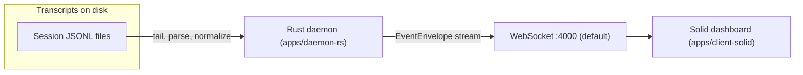
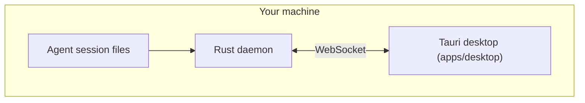
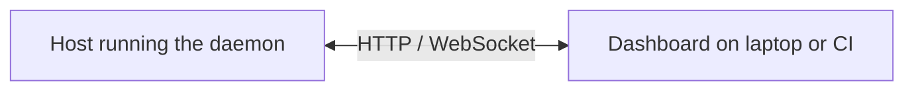
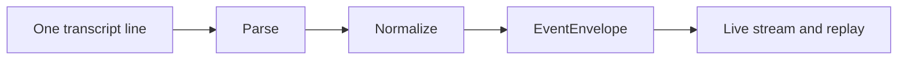

# How Pharos fits together

**Audience:** Anyone who wants a **picture of the moving parts** before diving into prose or code — developers, reviewers, and contributors.

The in-app docs portal renders the figures below from **Mermaid** diagrams. If you read this file on GitHub, you may see only the diagram source in code fences; open the same page in the dashboard under **How it works** for the rendered SVG.

---

## Local daemon and web dashboard

Typical open-source setup: the daemon reads session transcripts on the same machine, exposes a WebSocket, and the Solid dashboard connects as a client.

---

## Desktop app

The packaged **Tauri** shell embeds the same dashboard experience. A **local daemon** still provides the event stream; the UI talks to it over the same style of WebSocket contract (typically on localhost).

---

## Remote daemon (VPS)

You can run the daemon where transcripts are produced (or reachable) and open the dashboard elsewhere, as long as **network routing and trust boundaries** match how you deploy. See [Daemon on a server](getting-started-remote-daemon.md).

---

## From transcript line to event

The daemon is responsible for **discovery**, **tailing**, and **normalization**. The stable contract for what the UI consumes is the **event envelope** in Rust (`apps/daemon-rs/src/model.rs`).

---

## Related reading

- [Sessions, events, and the graph](understanding-sessions-and-events.md) — vocabulary for what you see in the UI.
- [Desktop vs web dashboard](desktop-vs-daemon-web.md) — when to choose each shape.
- [Architecture cheat sheet](../CLAUDE.md) — short definitions and dev commands for contributors.
- [HTTP and WebSocket API](frontend-api-reference.md) — integrator-facing contract.
